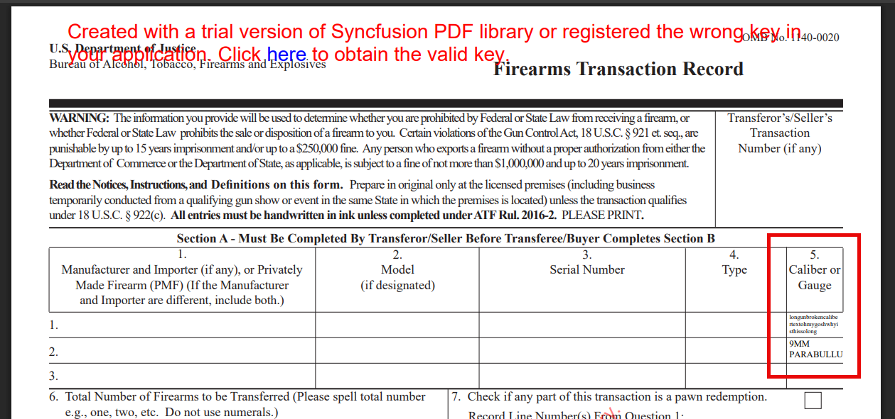
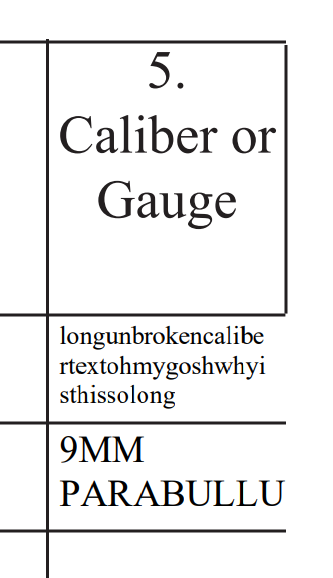

# Syncfusion.Pdf.Net.Core 29.1.40 is not properly auto-resizing text

I have a government PDF form that I need to fill out.

There are two "Caliber or Gauge" text boxes in the PDF that I need to fill out:



The box on line 1 contains the following text: `longunbrokencalibertextohmygoshwhyisthissolong`

The box on line 2 contains the following text: `9MM PARABULLUM`

If you zoom in on those two fields, you can see that:

- On line 1, the text containing no white space (`longunbrokencalibertextohmygoshwhyisthissolong`) is displayed completely; all text is visible
- On line 2, the text containing a space (`9MM PARABULLUM`) has a line break where the space is: `9MM` is displayed on the first line of the field, and `PARABULLU` is displayed on the second line. The word `PARABULLUM` has been clipped, and its last letter `M` is not visible.



Here is the C# code that I am using to fill those fields:

```csharp
private static void FillCaliberField(PdfLoadedDocument pdfDocument, string fieldName, string longCaliber)
{
    if (pdfDocument.Form.Fields.TryGetField(fieldName: fieldName, out PdfLoadedField pdfLoadedField1))
    {
        var caliberLoadedTextBoxField = (PdfLoadedTextBoxField)pdfLoadedField1;

        // Fill the .Text property first. If the text doesn't fit, tell Syncfusion to auto-resize the text to fit.
        caliberLoadedTextBoxField.Text = longCaliber;

        // If the text will be clipped, set the text box to auto-resize the text so that it fits.
        if (IsTextClipped(longCaliber, caliberLoadedTextBoxField))
        {
            caliberLoadedTextBoxField.AutoResizeText = true;
        }
    }
}

/// <summary>
/// Check to see if the text will fit in the text box. If not, make the text box an auto-size field.
/// </summary>
private static bool IsTextClipped(string? text, PdfLoadedTextBoxField textField)
{
    if (string.IsNullOrWhiteSpace(text))
    {
        return false;
    }

    // The "layouter" determines whether the text will be clipped in the given textbox.
    var layouter = new PdfStringLayouter();
    var layoutResult = layouter.Layout(text, textField.Font, new PdfStringFormat(textField.TextAlignment), new SizeF(textField.Bounds.Width, textField.Bounds.Height));

    // If Remainder is a non-null, non-white space string, then there is clipped text, and
    //   we need to make the field auto-sized.
    return !string.IsNullOrWhiteSpace(layoutResult.Remainder);
}
```

As you can see, it sets the `PdfLoadedTextBoxField`'s Text property, and then uses `PdfStringLayouter` to determine if the entire string will be visible in the form field. If not, then we set `AutoResizeText` to true.

## Expected Behavior

When `AutoResizeText` is true, I expect the field containing `9MM PARABULLUM` to be sized appropriately so that all text is visible.

## Actual Behavior

As noted in the screenshots above, the auto-resized text is a little too big, and the last letter `M` from the word `PARABULLUM` is not visible in the filled PDF.

## What's in this solution?

This solution contains a full reproduction of the issue:

1. Clone the repository at https://github.com/jonsagara/SyncfusionSandbox
1. Inside the repository root directory, open `SyncfusionPdfLongText\SyncfusionPdfLongText.sln`
1. Change the location of where you want the filled PDF to be written. By default, it goes on the Desktop.
   
   Look for this line:

   `var filledPdfFilePath = Path.Combine(Environment.GetFolderPath(Environment.SpecialFolder.Desktop), "filled.pdf");`
1. Run the solution

The program will open the template file, fill the two `Caliber or Gauge` fields, write the filled PDF to disk, and then open it in your OS's default PDF viewer.


# Environment

- Visual Studio 2022 17.14.0 Preview 5.0
- .NET SDK 9.0.203
- C# 13
- Windows 11 24H2 (OS Build 26100.3775)
- Syncfusion.Pdf.Net.Core 29.1.40
