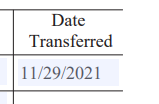

# Using Syncfusion.Pdf to measure text size

I'm using Syncfusion.Pdf to fill a PdfLoadedTextBoxField with a date formatted as MM/dd/yyyy. You can see that if I open the PDF and manually type in the date, it fits within the bounds of the text field, using the text field's default font size:



In order to ensure that my data is not truncated when I fill the form, I look at runtime to see if my strings will fit inside their target text box fields. If Syncfusion.Pdf tells me they will not, then I'll set AutoResizeText = true on the text box field.

The problem I'm having is that Syncfusion.Pdf will tell me that the string will not fit within a text box field, when it clearly will. For the date based above, the included sample program outputs the following:

```text
***
*** Checking string '11/29/2021' to see if it will fit within PdfLoadedTextBoxField 'topmostSubform[0].Page1[0].Transferdate1[0]'
***

TextBox Bounds:
  Width: 50.461975
  Height: 13.626

MeaureString:
  Width: 66.51
  Height: 12.123001

Layout result:
  ActualSize:
    Width: 47.007004
    Height: 12.123001
  LineHeight: 12.123001
  Lines:
    Line:
      LineType: LayoutBreak, FirstParagraphLine
      Text: 11/29/2
      Width: 47.007004
  Remainder: 021

***
*** Syncfusion.Pdf reports that the string '11/29/2021' will NOT fit within the TextBoxField.
***
```

So even though I can manually type '11/29/2021' into the text box and it fits perfectly, Syncfusion.Pdf is telling me that it can only fit '11/29/2' into the text box, and that '021' will be cut off.

Am I doing something wrong?

## To reproduce the manual editing

1. Open src\SyncfusionPdfTextSize\templates\form.pdf
1. For Question 3, enter the string 11/29/2021 into the first text box under the Date Transferred column

## To reproduce the output from Syncfusion.Pdf

1. Open the solution in Visual Studio
1. Run the application


## Environment

```
Visual Studio 2022 17.1.2
.NET 6.0.201
Syncfusion.Pdf.Net.Core 19.4.0.56
```